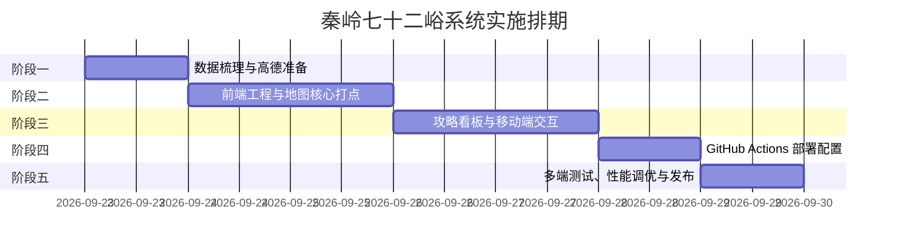

# 秦岭七十二峪互动导游系统：项目实施计划与技术方案

> **文档说明**：本文件专用于规划“秦岭七十二峪互动导游系统”基于 **GitHub Pages** 纯静态托管环境下的技术架构设计与项目分阶段实施推进计划（仅包含方案规划，不包含业务执行代码）。

---

## 目录
1. [系统总体技术架构方案](#一系统总体技术架构方案)
2. [核心模块与关键技术实现](#二核心模块与关键技术实现)
3. [项目实施阶段与排期计划](#三项目实施阶段与排期计划)
4. [CI/CD 自动化部署设计 (GitHub Actions)](#四cicd-自动化部署设计-github-actions)
5. [风险识别与应对措施](#五风险识别与应对措施)
6. [日常维护与数据更新手册](#六日常维护与数据更新手册)

---

## 一、系统总体技术架构方案

### 1.1 架构设计理念
本项目采用现代 **Jamstack（纯前端静态化 + 离线数据驱动）** 架构。旨在彻底去除传统后端服务器与复杂数据库的运维成本，利用全球 CDN（GitHub Pages）实现零成本托管、秒级加载和高可用性。

### 1.2 系统拓扑图

```
┌─────────────────────────────────────────────────────────────────────────┐
│                        用户终端 (移动端 H5 / 微信 / PC 桌面)             │
└────────────────────────────────────┬────────────────────────────────────┘
                                     │ HTTPS
┌────────────────────────────────────▼────────────────────────────────────┐
│                    GitHub Pages 全球 CDN 静态托管                        │
│ ┌─────────────────────────────────────────────────────────────────────┐ │
│ │ 前端静态单页应用 (Single Page Application - SPA)                     │ │
│ │ ├─ UI 渲染框架: Vue 3 (Composition API) + Vite                      │ │
│ │ ├─ 样式与响应式: Tailwind CSS (移动端优先，暗色/山系自然色调)         │ │
│ │ ├─ 状态管理: Pinia (选中山谷、筛选器状态、地图中心视口控制)            │ │
│ │ └─ 图标库: Lucide Icons (露营、水源、洗手间、危险预警轻量矢量图标)    │ │
│ └─────────────────────────────────────────────────────────────────────┘ │
│ ┌─────────────────────────────────────────────────────────────────────┐ │
│ │ 静态数据驱动层 (Static JSON Data Layer)                                │ │
│ │ ├─ public/data/valleys.json (72峪全量GCJ-02坐标、区域与红绿灯状态)    │ │
│ │ └─ public/data/top10_details.json (首批10大核心峪口深度露营与美食数据)│ │
│ └─────────────────────────────────────────────────────────────────────┘ │
└──────────────────────────┬─────────────────────────────┬────────────────┘
                           │                             │
                           ▼                             ▼
┌─────────────────────────────────────┐       ┌───────────────────────────┐
│     高德地图开放平台 (JS API v2.0)   │       │     高德导航唤起组件      │
│ ├─ AMap.Map (底图渲染与手势交互)    │       │ ├─ 移动端: amapuri://     │
│ ├─ AMap.MarkerCluster (海量点聚合)  │       │ └─ PC Web: uri.amap.com/  │
│ └─ 自定义 HTML Marker (红绿呼吸灯)  │       │    (零额外 API 计费配额)  │
└─────────────────────────────────────┘       └───────────────────────────┘
```

### 1.3 技术栈选型明细

| 层次 | 选用技术 / 工具 | 选型理由 |
| :--- | :--- | :--- |
| **构建框架** | **Vite + Vue 3** | 开发秒级热重载，打包体积小，组件化组织结构清晰。 |
| **UI 样式库** | **Tailwind CSS** | 原子化 CSS，方便编写移动端抽屉（Drawer）、毛玻璃质感与呼吸灯动效，避免样式污染。 |
| **地图服务** | **高德地图 JS API v2.0** | 国内合规坐标系（GCJ-02），国内路网精准；个人免费额度充足；原生支持点聚合与自定义 DOM Marker。 |
| **静态数据** | **标准 JSON 文件** | 72峪数据总量 < 100KB，直接打入前端或由浏览器静态请求，彻底省去数据库与 API 查询延迟。 |
| **托管发布** | **GitHub Pages** | 零服务器购置费，自带免费全球 CDN 与 SSL 证书。 |
| **持续集成** | **GitHub Actions** | 代码推送到主分支自动触发构建与发布，完全免人工上传。 |

---

## 二、核心模块与关键技术实现

### 2.1 静态数据结构设计 (`public/data/`)

#### 1. 72 峪全景数据 (`valleys.json`)
```json
[
  {
    "id": "VALLEY_034",
    "name": "大峪",
    "city": "西安市",
    "district": "长安区",
    "lng": 109.04,
    "lat": 34.02,
    "difficulty": "休闲",
    "status": 1,
    "is_top10": true,
    "tags": ["水库露营", "活水虹鳟", "自驾直达"],
    "summary": "水库碧波荡漾，星空露营与鳟鱼美食聚集"
  }
]
```

#### 2. 首批 10 核心深度攻略数据 (`top10_details.json`)
包含每个核心峪口的**露营四维指标看板**、**特色农家乐列表**以及**防汛安全提示**：
```json
{
  "VALLEY_034": {
    "camping_dashboard": {
      "allow_overnight": true,
      "water_source": "山泉溪流（需过滤煮沸）",
      "vehicle_accessibility": "私家车全程硬化路直达",
      "toilet_available": true,
      "has_flash_flood_risk": true,
      "flood_warning": "严禁在水库下游及干涸河道内私自搭设帐篷过夜"
    },
    "signature_foods": ["现捞活水虹鳟鱼（一鱼三吃）", "大峪土鸡焖砂锅"],
    "recommended_agritainment": [
      {
        "name": "大峪老李水泉农家院",
        "tag": "活水鱼/土鸡/山野菜",
        "price_per_person": "¥65"
      },
      {
        "name": "大峪星空野奢露营餐吧",
        "tag": "野奢天幕/咖啡下午茶",
        "price_per_person": "¥98"
      }
    ],
    "around": {
      "campsites": [
        { "name": "大峪星空野奢营地", "type": "commercial", "note": "水库上游，需预约" },
        { "name": "水库上游指定平地", "type": "wild", "note": "无痕山林，禁入河道与下游滩地" }
      ],
      "family_spots": [
        { "name": "大峪水库浅滩戏水区", "note": "夏季戏水，需成人全程看护" }
      ],
      "photo_spots": [
        { "name": "大峪水库大坝观景平台", "note": "库区水面与群山同框" }
      ]
    }
  }
}
```

> **三类周边清单约定**：`around` 为新增模块，含 `campsites`（type: commercial 收费营地 / wild 野营地 / rv 房车营地）、
> `family_spots`（亲子，note 必写强度与看护要求）、`photo_spots`（打卡点，note 只写机位与看点）。
> 与其余字段一致：**不收录任何联系方式**；未核实条目不进推荐位，前端统一显示「待核实」。

### 2.2 高德地图打点与交互策略

1. **海量点聚合 (AMap.MarkerCluster)**：
   - 远景层级（Zoom 7-11）：密集峪口合并为地市/区县统计泡（如“西安 40”）；
   - 近景层级（Zoom ≥ 12）：散开为独立峪口 Marker，防止手机端重叠遮挡。
2. **状态红绿呼吸灯**：
   - 绿灯（`status: 1`）：翠绿光晕动态呼吸扩散（`animate-ping`），提示正常通行；
   - 红灯（`status: 0`）：鲜红警示高亮，代表汛期封山或防汛管控；
   - Top 10 核心峪口 Marker 顶部增加金色五星标识。
3. **行政区域快速聚焦**：
   - 界面顶部设快速切换按钮：【全景】【西安 40 峪】【渭南 25 峪】【宝鸡 7 峪】；
   - 点击调用 `map.setCenterAndZoom()` 触发平滑过渡镜头平移动画。
4. **一键唤起高德自驾导航（零配额消耗）**：
   - 移动端：直接调起协议 `amapuri://route/plan/?dlat=${lat}&dlon=${lng}&dname=${name}&dev=0&t=0`；
   - PC 网页端：新窗口打开 `https://uri.amap.com/navigation?to=${lng},${lat},${name}&mode=car&policy=1&src=qinling72`。

### 2.3 移动端 UI/UX 体验设计

1. **下拖式抽屉布局（Bottom Sheet Drawer）**：
   - 移动端首屏以地图为中心，底部呈现半折叠的峪口列表卡片；
   - 用户上滑可展开完整搜索与筛选面板；
   - 点击地图 Marker 时，底部滑出该峪口的深度露营看板与农家乐菜单。
2. **防汛高危横幅（Flood Risk Banner）**：
   - 针对有河滩山洪风险的峪口，在详情面板顶部吸顶展示高对比度黄色警示块：`“⚠️ 防汛安全警示：严禁在干涸河滩与泄洪道扎营夜宿！”`。

---

## 三、项目实施阶段与排期计划

项目整体周期预计为 **7 个工作日**，分 5 个阶段里程碑逐步推进：



### 详细任务分解表

| 阶段里程碑 | 周期 | 核心交付成果 | 验收标准 |
| :--- | :---: | :--- | :--- |
| **M1: 数据梳理与凭证准备** | Day 1 | 1. 结构化 `valleys.json` (72峪)<br>2. 深度数据 `top10_details.json`<br>3. 高德 Web JS API Key 及安全密钥 | 经纬度合规无漂移，数据格式 JSON 校验通过。 |
| **M2: 前端工程与地图核心打点** | Day 2~3 | 1. Vite + Vue 3 + Tailwind 工程搭建<br>2. 高德底图初始化与 MarkerCluster 点聚合<br>3. 红绿呼吸灯 Marker 样式与区域平移切换 | 72 峪点位完整加载，缩放流畅无卡顿，红绿灯状态准确展现。 |
| **M3: 攻略看板与移动端交互** | Day 4~5 | 1. 移动端 Bottom Sheet 抽屉组件<br>2. 10 大核心名峪露营四维看板<br>3. 农家乐推荐模块与防汛警示条<br>4. 一键拉起高德导航逻辑 | 点击任意峪口能快速查看攻略并能成功拉起高德导航。 |
| **M4: GitHub Actions 部署配置** | Day 6 | 1. `vite.config.js` 适配 `base` 路径<br>2. `.github/workflows/deploy.yml` 自动化脚本<br>3. GitHub Pages 分支关联 | 提交代码到 `main` 分支后，流水线 2 分钟内自动部署至 `gh-pages`。 |
| **M5: 多端测试与正式发布** | Day 7 | 1. 移动端（iOS Safari/微信浏览器/安卓）真机测试<br>2. 静态资源加载性能优化（Gzip/Brotli）<br>3. 免责声明与日常维护手册交付 | 线上地址无报错，首屏渲染 FCP < 1.5s，正式对外发布。 |

---

## 四、CI/CD 自动化部署设计 (GitHub Actions)

### 4.1 部署工作流配置文件 (`.github/workflows/deploy.yml`)

```yaml
name: Deploy Qinling 72 Valleys to GitHub Pages

on:
  push:
    branches:
      - main  # 监听 main 分支的提交推送

permissions:
  contents: write  # 赋予写入权限以自动发布到 gh-pages 分支

jobs:
  build-and-deploy:
    runs-on: ubuntu-latest

    steps:
      - name: 检出代码 (Checkout)
        uses: actions/checkout@v4

      - name: 设置 Node.js 环境
        uses: actions/setup-node@v4
        with:
          node-version: 18
          cache: 'npm'

      - name: 安装项目依赖
        run: npm ci

      - name: 构建生产静态包
        run: npm run build

      - name: 发布至 GitHub Pages 分支
        uses: peaceiris/actions-gh-pages@v4
        with:
          github_token: ${{ secrets.GITHUB_TOKEN }}
          publish_dir: ./dist
          cname: '' # 若有自定义独立域名可在此填入
```

### 4.2 Vite 路径适配说明 (`vite.config.js`)
由于 GitHub Pages 默认托管于仓库二级路径，打包基础路径需进行对齐：
```javascript
import { defineConfig } from 'vite'
import vue from '@vitejs/plugin-vue'

export default defineConfig({
  plugins: [vue()],
  base: '/Qinling72valleys/', // 确保与 GitHub 仓库名称完全一致
})
```

---

## 五、风险识别与应对措施

| 潜在风险点 | 影响度 | 预防及应对措施 |
| :--- | :---: | :--- |
| **高德地图 API Key 滥用风险** | 中 | 在高德开放平台后台配置 **Referer 域名白名单**，严格限定仅允许 `https://<用户名>.github.io` 及其子路径调用。 |
| **移动端手势冲突 (滑动与地图拖动)** | 高 | 地图外层包裹手势隔离区，抽屉组件设置专属拖动把手（Drag Handle），避免横划/竖划手势被地图原生事件拦截。 |
| **汛期山洪突发封山信息滞后** | 高 | 界面核心区域显式标注数据更新时间，并强提示：“*秦岭山区气候多变，进山前请务必致电属地应急管理部门确认最新开放状况*”。 |
| **首屏静态资源加载体积过大** | 低 | 静态数据做拆分压缩，72峪主列表仅保留经纬度和基础状态，详情及营地大图按需异步渲染。 |

---

## 六、日常维护与数据更新手册

系统上线后，日常管理**无需登录后端系统**，全部维护通过 GitHub 仓库操作：

1. **临时封山 / 解封变灯**：
   - 打开 GitHub 网页仓库，进入 `public/data/valleys.json`；
   - 找到对应峪口（如大峪），将 `"status": 1` 改为 `"status": 0`（红灯）；
   - 在网页端点击 `Commit changes`，GitHub Actions 自动构建，1~2 分钟内线上环境自动生效。
2. **新增第二批核心名峪攻略**：
   - 直接在 `public/data/top10_details.json` 中按规范追加新峪口的四维看板与农家乐清单；
   - 提交更新后即时全网同步。
