# 秦岭七十二峪互动导游系统 产品需求规格说明书 (PRD)

| 文档版本 | 更新日期 | 修订人 | 修订说明 | 状态 |
| :--- | :--- | :--- | :--- | :--- |
| v1.0 | 2026-09-22 | Antigravity PM | 基于 geministudy 需求重构：聚焦位置展示、游玩攻略、72峪名录及首批10大核心峪口深度营地农家乐数据 | 正式发布 |

---

## 1. 项目背景与产品目标

### 1.1 项目背景
秦岭素有“国家中央公园”、“中华地理分界线”之称。秦岭北麓（横跨宝鸡、西安、渭南三市）散布着著名的“七十二峪”，是周边市民及全国户外徒步爱好者周末休闲、避暑露营的核心目的地。
然而，当前户外出游面临以下痛点：
1. **信息碎片分散**：72峪口具体位置、所属区县、导航入口不清晰；
2. **游玩决策成本高**：哪条峪可以野营/有水源/车能否直达/有无农家乐特色美食缺乏结构化整理；
3. **安全隐患突出**：山洪汛期、封山管制等状态信息不同步，野外夜宿风险不可控。

### 1.2 产品定位与核心目标
打造一款轻量级、高颜值、实用性强的**秦岭七十二峪数字化互动导游与户外出游决策平台**：
- **全面呈现**：一次性收录整理秦岭北麓**全部72个峪口**的地理分布、所属区域与导航点位；
- **实用攻略**：精选**首批10个核心高热度峪口**，深度提供露营配套指标（四维看板）、特色美食/农家乐、徒步难度与安全防汛须知；
- **地图互动**：基于高德地图 Web API 实现区域联动筛选、海量打点、呼吸灯状态显示与一键拉起高德导航。

---

## 2. 核心用户故事与功能架构

### 2.1 核心功能架构 (IA)

```mermaid
flowchart TD
    App[秦岭七十二峪互动导游系统]
    App --> ModMap[地图互动探索模块]
    App --> ModList[七十二峪全景目录与检索]
    App --> ModDetail[峪口深度攻略详情页]
    App --> ModAdmin[后台安全风控中心]

    ModMap --> Map1[行政区划联动缩放: 西安48/宝鸡7/渭南17]
    ModMap --> Map2[点聚合 MarkerCluster & 呼吸灯 Marker]
    ModMap --> Map3[高德地图 InfoWindow 概览弹窗]
    ModMap --> Map4[一键高德URI唤起自驾导航]

    ModList --> List1[按地市/区县分级筛选]
    ModList --> List2[徒步难度与开放状态快速筛选]
    ModList --> List3[首批10个核心推荐角标标注]

    ModDetail --> Det1[首批10峪: 露营配套四维看板]
    ModDetail --> Det2[首批10峪: 本地农家乐与特色美食]
    ModDetail --> Det3[徒步/自驾游玩路线指南]
    ModDetail --> Det4[防汛安全警示: 禁止河滩夜宿高亮]
    ModDetail --> Det5[周边露营地: 商业/野营/房车三类分列]
    ModDetail --> Det6[周边亲子游玩景点: 强度与适龄提示]
    ModDetail --> Det7[网红打卡点: 机位说明 + 危险机位劝退]

    ModAdmin --> Adm1[峪口状态一键变灯: 绿灯开放 / 红灯封山]
    ModAdmin --> Adm2[突发天气与防汛预警广播]
```



### 2.2 用户故事 (Epics & User Stories)

- **US-1.1（区域联动与平移缩放）**：用户在顶部点击“西安市（48峪）”、“渭南市（17峪）”、“宝鸡市（7峪）”，高德地图平滑平移至对应行政区域并缩放适配视野。
- **US-1.2（点聚合与状态呼吸灯）**：缩放至远景时自动聚合展示数量；放大至近景展现具体峪口 Marker。绿灯表示安全通行，红灯表示汛期/雪季管制封山。
- **US-1.3（高德一键导航）**：用户在 Marker 信息弹窗或详情页点击“开始导航”，移动端自动唤起高德地图 App 路线规划，PC 端新窗口打开高德 Web 导航（不消耗额外收费 API 配额）。
- **US-1.4（首批10大峪口深度看板）**：针对首批10个名峪，提供“露营设施四维看板”（能否过夜、水源类型、车行直达性、公厕配套）以及周边正规农家乐名单与特色菜推荐。
- **US-1.5（防汛安全与河滩警告）**：遇暴雨预警或河滩高危路段，详情页顶部强制吸顶展示黄色“防汛警示：禁止河滩夜宿”及应急求助电话。

---

## 3. 秦岭七十二峪完整地理名录（全景收录表）

秦岭七十二峪自东向西横跨渭南、西安、宝鸡三市，民间标准流传名录共计72个（渭南25峪/西安40峪/宝鸡7峪，或传统分区划分），系统全量录入如下：

### 3.1 渭南地区（自东向西共 25 峪）
| 序号 | 峪口名称 | 行政区域 | 坐标基准 (GCJ-02近似) | 特色 / 游玩概述 | 第一批核心 |
| :--- | :--- | :--- | :--- | :--- | :---: |
| 1 | **西峪** | 渭南市潼关县 | 110.26, 34.48 | 潼关古道要塞，山险水清 | - |
| 2 | **桐峪** | 渭南市潼关县 | 110.21, 34.46 | 产黄金重地，有古金矿文化 | - |
| 3 | **善车峪** | 渭南市潼关县 | 110.15, 34.47 | 原生态古道，适合探幽 | - |
| 4 | **太公峪** | 渭南市潼关县 | 110.11, 34.46 | 传姜太公曾在此隐居 | - |
| 5 | **麻峪** | 渭南市潼关县 | 110.08, 34.47 | 野趣徒步线路 | - |
| 6 | **蒿岔峪** | 渭南市潼关县 | 110.05, 34.46 | 深山植被茂密，夏日清凉 | - |
| 7 | **潼峪** | 渭南市潼关县 | 110.02, 34.47 | 潼水发源地，历史底蕴厚重 | - |
| 8 | **蒲峪** | 渭南市华阴市 | 109.98, 34.50 | 华阴东大门峪道之一 | - |
| 9 | **杜峪** | 渭南市华阴市 | 109.95, 34.51 | 原生态农耕风情，山谷幽静 | - |
| 10 | **黄甫峪** | 渭南市华阴市 | 109.92, 34.52 | 华山东麓索道进山主干道 | - |
| 11 | **华山峪** | 渭南市华阴市 | 109.90, 34.54 | “自古华山一条路”经典登山口 | ★ **第10峪** |
| 12 | **仙峪** | 渭南市华阴市 | 109.87, 34.52 | 奇石秀水，自然风光绝美 | - |
| 13 | **翁峪** | 渭南市华阴市 | 109.83, 34.50 | 峡谷幽深，适合深度穿越 | - |
| 14 | **竹峪** | 渭南市华阴市 | 109.80, 34.49 | 漫山翠竹，水流潺潺 | - |
| 15 | **大敷峪** | 渭南市华阴市 | 109.76, 34.48 | 进山通往金堆城，交通方便 | - |
| 16 | **柳峪** | 渭南市华阴市 | 109.72, 34.47 | 野外探险，幽静少人 | - |
| 17 | **葱峪** | 渭南市华阴市 | 109.68, 34.46 | 林木茂盛，原生态徒步 | - |
| 18 | **沟峪** | 渭南市华州区 | 109.65, 34.45 | 溪涧流淌，夏日休闲 | - |
| 19 | **小夫峪** | 渭南市华州区 | 109.61, 34.46 | 沿溪散步，石景秀丽 | - |
| 20 | **石堤峪** | 渭南市华州区 | 109.58, 34.47 | 历史石堤遗址，山水相映 | - |
| 21 | **桥峪** | 渭南市华州区 | 109.54, 34.45 | 桥峪水库所在，风景秀丽 | - |
| 22 | **东涧峪** | 渭南市华州区 | 109.50, 34.46 | 原生态峡谷溪流 | - |
| 23 | **西涧峪** | 渭南市华州区 | 109.47, 34.47 | 户外野炊与亲水胜地 | - |
| 24 | **箭峪** | 渭南市临渭区 | 109.42, 34.43 | 箭峪水库，风光开阔 | - |
| 25 | **黄峪** | 渭南市临渭区 | 109.38, 34.42 | 浅山丘陵风貌 | - |

---

### 3.2 西安地区（自东向西共 40 峪）
| 序号 | 峪口名称 | 行政区域 | 坐标基准 (GCJ-02近似) | 特色 / 游玩概述 | 第一批核心 |
| :--- | :--- | :--- | :--- | :--- | :---: |
| 26 | **清峪** | 西安市蓝田县 | 109.35, 34.18 | 峡谷平整、草甸溪流，轻户外徒步热门 | ★ **第8峪** |
| 27 | **道沟峪** | 西安市蓝田县 | 109.31, 34.16 | 蓝田小众幽静峡谷 | - |
| 28 | **辋峪** | 西安市蓝田县 | 109.28, 34.14 | 王维《辋川集》所在地，诗意山水文化 | ★ **第9峪** |
| 29 | **岱峪** | 西安市蓝田县 | 109.23, 34.11 | 沿途梯田民居，秋季赏红叶路线 | - |
| 30 | **小洋峪** | 西安市蓝田县 | 109.19, 34.09 | 小巧清幽，溪水浅澈 | - |
| 31 | **东汤峪** | 西安市蓝田县 | 109.15, 34.07 | 著名汤峪温泉胜地，康养度假首选 | - |
| 32 | **库峪** | 西安市长安区 | 109.12, 34.04 | 太兴山铁庙险峰，徒步烧香胜地 | - |
| 33 | **扯袍峪** | 西安市长安区 | 109.08, 34.03 | 传李世民扯袍处，人少景美小众路线 | - |
| 34 | **大峪** | 西安市长安区 | 109.04, 34.02 | 水库碧波荡漾，星空露营与鳟鱼美食聚集 | ★ **第1峪** |
| 35 | **白道峪** | 西安市长安区 | 109.02, 34.03 | 进山通往古寺，林木阴凉 | - |
| 36 | **小峪** | 西安市长安区 | 108.99, 34.02 | 拥有小峪水库，适合周末慢节奏休闲散步 | - |
| 37 | **土门峪** | 西安市长安区 | 108.97, 34.02 | 二郎山景区，休闲散心 | - |
| 38 | **蛟峪** | 西安市长安区 | 108.95, 34.01 | 原生态野趣，徒步初学者路线 | - |
| 39 | **太乙峪** | 西安市长安区 | 108.94, 34.00 | 翠华山国家地质公园，天池、冰风洞地质奇观 | ★ **第4峪** |
| 40 | **石砭峪** | 西安市长安区 | 108.92, 33.99 | 石砭峪水库所在地，盘山路壮观 | - |
| 41 | **天子峪** | 西安市长安区 | 108.90, 34.01 | 至相寺祖庭所在地，深山古刹清净 | - |
| 42 | **抱龙峪** | 西安市长安区 | 108.88, 34.02 | 唐王抱龙传说，老龙桥自然风光 | - |
| 43 | **子午峪** | 西安市长安区 | 108.85, 34.03 | 荔枝古道起点，金仙观道教文化，户外打卡标杆 | ★ **第2峪** |
| 44 | **白石峪** | 西安市长安区 | 108.83, 34.02 | 白石嶙峋，溪水浅澈适合戏水 | - |
| 45 | **皇峪** | 西安市长安区 | 108.81, 34.01 | 翠微宫遗址，高山草甸开阔 | - |
| 46 | **沣峪** | 西安市长安区 | 108.79, 34.00 | 210国道主通道，九龙潭、观音山、锅盔美食 | ★ **第3峪** |
| 47 | **祥峪** | 西安市长安区 | 108.76, 34.01 | 祥峪森林公园，瀑布成群，植被茂密 | - |
| 48 | **高冠峪** | 西安市长安区 | 108.73, 34.03 | 高冠瀑布闻名古今，李白咏诗地 | ★ **第5峪** |
| 49 | **紫阁峪** | 西安市鄠邑区 | 108.70, 34.03 | 紫阁晴岚为长安八景之一，玄奘法师骨灰埋藏地 | - |
| 50 | **太平峪** | 西安市鄠邑区 | 108.67, 34.04 | 太平国家森林公园，天然紫荆花海与八瀑奇观 | ★ **第6峪** |
| 51 | **鸽勃峪** | 西安市鄠邑区 | 108.64, 34.04 | 小众险奇峪道，适合轻装徒步 | - |
| 52 | **乌桑峪** | 西安市鄠邑区 | 108.62, 34.05 | 山势陡峭，山泉清洌 | - |
| 53 | **黄柏峪** | 西安市鄠邑区 | 108.59, 34.05 | 野生黄柏树众多，山谷幽长 | - |
| 54 | **化羊峪** | 西安市鄠邑区 | 108.57, 34.06 | 化羊古庙文化遗存，逢庙会香火极盛 | - |
| 55 | **曲峪** | 西安市鄠邑区 | 108.54, 34.06 | 金龙峡风景区所在地，九瀑十八潭 | - |
| 56 | **涝峪** | 西安市鄠邑区 | 108.50, 34.07 | 西汉高速穿越，黑山岔瀑布与丰富农家乐聚落 | ★ **第7峪** |
| 57 | **栗峪** | 西安市鄠邑区 | 108.47, 34.07 | 满山野生板栗树，秋日采风佳选 | - |
| 58 | **潭峪** | 西安市鄠邑区 | 108.43, 34.08 | 潭水连绵清澈，亲水休闲胜地 | - |
| 59 | **甘峪** | 西安市鄠邑区 | 108.39, 34.08 | 甘峪水库风景如画，适宜垂钓观景 | - |
| 60 | **耿峪** | 西安市周至县 | 108.34, 34.09 | 溪水深潭交错，避暑戏水热门 | - |
| 61 | **赤峪** | 西安市周至县 | 108.30, 34.10 | 丹霞红色山岩局部显现 | - |
| 62 | **田峪** | 西安市周至县 | 108.26, 34.10 | 楼观台后山，道教洞天福地 | - |
| 63 | **就峪** | 西安市周至县 | 108.22, 34.11 | 沿途地势平缓，林木青翠 | - |
| 64 | **黑峪** | 西安市周至县 | 108.17, 34.12 | 黑河水利枢纽引水地，峡谷深邃 | - |
| 65 | **西骆峪** | 西安市周至县 | 108.12, 34.12 | 骆峪水库，风光苍茫纯朴 | - |

---

### 3.3 宝鸡地区（自东向西共 7 峪）
| 序号 | 峪口名称 | 行政区域 | 坐标基准 (GCJ-02近似) | 特色 / 游玩概述 | 第一批核心 |
| :--- | :--- | :--- | :--- | :--- | :---: |
| 66 | **竹峪** | 西安周至/眉县交界 | 108.06, 34.13 | 翠竹掩映，交界特色古道 | - |
| 67 | **泥峪** | 宝鸡市眉县 | 107.98, 34.14 | 浅山农林景观，原生态徒步 | - |
| 68 | **西汤峪** | 宝鸡市眉县 | 107.89, 34.15 | 太白山国家森林公园进山口，温泉与雪山盛景 | ★ **首批备选** |
| 69 | **滑峪** | 宝鸡市眉县 | 107.82, 34.16 | 碎石滑坡地质风貌，探险野线 | - |
| 70 | **小黑峪** | 宝鸡市眉县 | 107.76, 34.17 | 清幽避暑，峡谷幽静 | - |
| 71 | **大黑峪** | 宝鸡市眉县 | 107.71, 34.18 | 原始森林保护带，古道幽长 | - |
| 72 | **斜峪** | 宝鸡市眉县/岐山 | 107.64, 34.20 | 褒斜古道北出口，三国古栈道历史文化 | - |

---

## 4. 第一批 10 大核心名峪深度攻略（露营看板 + 农家乐）

第一批重点上线以下 10 个知名度最高、交通便利、配套设施较成熟的核心峪口。每个峪口强制提供**露营四维指标看板**和**特色农家乐与美食清单**，并新增三类周边清单：**周边露营地**（商业营地/野营地/房车营地分列）、**周边亲子游玩景点**（标注强度与适龄提示）、**网红打卡点**（标注机位说明，并对临崖、河道、未开发区域等危险机位明确劝退）。

> 三类周边清单与其余字段同等对待：未核实即在前端标注「待核实」，不得默认推荐。两条已定口径：
> - **打卡点只收录有文史或地标依据的机位**（`basis: historico` 碑刻/诗句/古道/古观；`landmark` 水库大坝/堰塞湖/瀑布/冰瀑/草甸/传统村落）。主观机位（光线、水雾、拍摄时段一类）一律不入库，不承诺效果，也不提供进入未开放区域的路线。
> - **亲子条目必须带 `age`（建议最小年龄，估算值）** 并写明看护要求；不适合低龄儿童的（如华山峪上山步道）明确劝退。

```
┌────────────────────────────────────────────────────────┐
│             首批 10 大核心峪口深度指标看板                │
├────────────────────────────────────────────────────────┤
│ 01. 大峪 (长安)  ── 水库露营 / 烧烤 / 冷水鳟鱼          │
│ 02. 子午峪 (长安) ── 荔枝古道 / 金仙观 / 帐篷营地       │
│ 03. 沣峪 (长安)  ── 210国道主干 / 农家土鸡 / 锅盔      │
│ 04. 太乙峪 (长安) ── 翠华山天池 / 设施完善收费营地      │
│ 05. 高冠峪 (长安) ── 李白诗赞瀑布 / 戏水浅滩农家乐     │
│ 06. 太平峪 (鄠邑) ── 紫荆花海 / 森林公园生态营地       │
│ 07. 涝峪 (鄠邑)  ── 黑山岔瀑布 / 农家手擀面 / 聚落民宿 │
│ 08. 清峪 (蓝田)  ── 开阔草甸露营 / 蓝田九大碗          │
│ 09. 辋峪 (蓝田)  ── 辋川诗境 / 禅意民宿 / 餄餎美食     │
│ 10. 华山峪 (华阴) ── 西岳险径 / 华山脚下特色汽锅鸡     │
└────────────────────────────────────────────────────────┘
```

### 4.1 详细攻略清单

#### 1. 长安 · 大峪（大峪水库与星空露营）
- **核心游玩亮点**：拥有大峪水库碧波景观，水库上游有十里庙、大峪星空野奢营地。春看野花，夏可戏水避暑。
- **露营四维指标看板**：
  - 是否允许夜宿：✅ 允许（限商业营地与指定平地）
  - 水源类型：山泉溪流（不可直接饮用，需煮沸）
  - 车辆直达性：🚗 全程硬化水泥路，私家车可直达营地
  - 公共洗手间：✅ 商业营地及沿途农家乐具备洗手间
- **防汛安全警示**：⚠️ **严禁在水库下游及干涸河道内私自搭设帐篷过夜**，上游暴雨易发泄洪山洪。
- **推荐农家乐与美食**：
  - 招牌美食：现捞活水虹鳟鱼（一鱼三吃：刺身/红烧/椒盐）、大峪土鸡焖砂锅
  - 推荐农家乐：大峪老李水泉农家院、大峪星空野奢露营餐吧

#### 2. 长安 · 子午峪（千年荔枝道与金仙古观）
- **核心游玩亮点**：唐代进贡荔枝的古道起点，峪口建有登山步道，中段有道教全真圣地金仙观，沿线环境整洁，适合徒步初学者和亲子休闲。
- **露营四维指标看板**：
  - 是否允许夜宿：⚠️ 峪口核心保护区禁止野外过夜，峪口外围营地可夜宿
  - 水源类型：自来水补给点 + 金仙观山泉
  - 车辆直达性：🚗 私家车需停放于峪口生态停车场，换乘景区摆渡车或徒步进山
  - 公共洗手间：✅ 峪口游客中心、金仙观公厕完善
- **推荐农家乐与美食**：
  - 招牌美食：子午绿豆饸饹、农家搅团、凉拌野菜
  - 推荐农家乐：子午仙庄、金仙山下素斋农舍

#### 3. 长安 · 沣峪（210 国道自驾线与九龙潭）
- **核心游玩亮点**：西安通往陕南的交通大动脉，自驾体验极佳。途经九龙潭瀑布群、净业寺、喂子坪，是周末自驾车流最大的峪口。
- **露营四维指标看板**：
  - 是否允许夜宿：✅ 喂子坪周边自驾露营地可过夜
  - 水源类型：沣河沿河溪流
  - 车辆直达性：🚗 210 国道铺装沥青路，各类车型畅行直达
  - 公共洗手间：✅ 沿途加油站、农家院集群、景区公厕密集
- **防汛安全警示**：汛期遇大雨 210 国道实施交通管制并立即封山变红灯。
- **推荐农家乐与美食**：
  - 招牌美食：沣峪口老字号辣子锅盔、柴火土鸡、洋芋糍粑
  - 推荐农家乐：喂子坪林间客栈、九龙山庄农家菜

#### 4. 长安 · 太乙峪（翠华山天池与地质公园）
- **核心游玩亮点**：国家 4A 级景区，著名的山崩地貌地质公园，拥有高山堰塞湖天池与常年冷风习习的冰风洞，设施最健全成熟。
- **露营四维指标看板**：
  - 是否允许夜宿：✅ 景区天池旁露营基地可正规过夜（需购票预约）
  - 水源类型：市政自来水配套
  - 车辆直达性：🚗 车辆直达景区大门及天池停车场
  - 公共洗手间：✅ 标准 3A 级旅游公厕
- **推荐农家乐与美食**：
  - 招牌美食：太乙矿泉豆腐、秦岭山野菜、烤虹鳟
  - 推荐农家乐：翠华山庄餐厅、太乙宫老院子土菜馆

#### 5. 长安 · 高冠峪（高冠飞瀑与诗意水镜）
- **核心游玩亮点**：唐代诗人李白、岑参曾游历并赋诗。瀑布气势磅礴，溪流平缓处水质清澈，是夏日戏水捞鱼、亲子聚餐的首选地。
- **露营四维指标看板**：
  - 是否允许夜宿：⚠️ 景区内夜间清场禁止野宿，周边民宿营地可过夜
  - 水源类型：山涧高冠瀑布水
  - 车辆直达性：🚗 环山路直入峪口停车场，步行 5 分钟入核心景区
  - 公共洗手间：✅ 景区内外洗手间完备
- **推荐农家乐与美食**：
  - 招牌美食：高冠烤土鸡、浆水鱼鱼、油炸花椒芽
  - 推荐农家乐：高冠听瀑楼、老高冠清泉农家院

#### 6. 鄠邑 · 太平峪（八瀑奇观与紫荆花谷）
- **核心游玩亮点**：万亩紫荆花海、彩虹瀑布。山内负氧离子极高，木栈道依山依水而建，舒适度高。
- **露营四维指标看板**：
  - 是否允许夜宿：✅ 峪内森林康养营地支持露营帐篷搭建
  - 水源类型：天然溪流 + 营地供水
  - 车辆直达性：🚗 观光主道直达景区入口，内部乘坐观光车
  - 公共洗手间：✅ 景区沿途多处卫生间
- **推荐农家乐与美食**：
  - 招牌美食：户县辣子酱、手撕土鸡、干炸小河虾
  - 推荐农家乐：太平红叶山庄、紫荆花开农家乐

#### 7. 鄠邑 · 涝峪（黑山岔瀑布与沙窝民俗聚落）
- **核心游玩亮点**：西汉高速涝峪口下车即达。内有黑山岔百米冰瀑/水瀑，沙窝村保留传统秦岭民俗农家院风貌。
- **露营四维指标看板**：
  - 是否允许夜宿：✅ 沙窝村及周边乡村营地支持过夜房车与帐篷
  - 水源类型：溪流与山泉
  - 车辆直达性：🚗 高速直达，乡村道路路况良好
  - 公共洗手间：✅ 村落聚落公共洗手间齐全
- **推荐农家乐与美食**：
  - 招牌美食：手擀杂面、农家辣子炒土猪肉、槐花麦饭
  - 推荐农家乐：沙窝老屋农家、黑山岔聚贤山庄

#### 8. 蓝田 · 清峪（天然高山草甸与平整水溪）
- **核心游玩亮点**：蓝田极为小众的高山草甸风貌，谷内宽阔开阔，溪流穿林而过，被户外圈誉为“西安周边小阿勒泰”。
- **露营四维指标看板**：
  - 是否允许夜宿：✅ 允许露营搭建（需严格执行“无痕山林”原则）
  - 水源类型：清澈溪流，需自带滤水器或自备饮用水
  - 车辆直达性：🚗 普通私家车可开至草甸入口水泥路尽头，部分非铺装路面需慢行
  - 公共洗手间：❌ 沿线无固定公厕，需自备移动户外卫生设备
- **防汛安全警示**：⚠️ 夏季草甸易遇强对流雷雨，雷雨天切勿在开阔山岗扎营。
- **推荐农家乐与美食**：
  - 招牌美食：蓝田九大碗、蓝田荞麦饸饹、葱花油旋
  - 推荐农家乐：清峪人家聚落、蓝田聚宝生态农庄

#### 9. 蓝田 · 辋峪（王维辋川图与禅意度假）
- **核心游玩亮点**：摩诘诗画《辋川集》二十景所在地，“明月松间照，清泉石上流”之发源地，文化底蕴深厚，禅意民宿集聚。
- **露营四维指标看板**：
  - 是否允许夜宿：✅ 周边禅意野奢营地、精致民宿花园露营
  - 水源类型：山泉水及市政自来水
  - 车辆直达性：🚗 全程沥青路面，车行直达
  - 公共洗手间：✅ 沿线公厕及精品民宿均具备良好设施
- **推荐农家乐与美食**：
  - 招牌美食：辋川神仙粉、蓝田饸饹、山野核桃豆腐
  - 推荐农家乐：辋川别业客栈、摩诘草堂茶食坊

#### 10. 华阴 · 华山峪（西岳庙与奇险登山口）
- **核心游玩亮点**：“自古华山一条路”徒步起始点。沿途有玉泉院、回心石、千尺幢、百尺峡，历史摩崖石刻密布。
- **露营四维指标看板**：
  - 是否允许夜宿：⚠️ 进山步道仅可在山顶营地/宾馆周边特定区域搭设帐篷
  - 水源类型：沿途服务驿站充足瓶装水补给
  - 车辆直达性：🚗 自驾停至华山游客中心/玉泉院停车场，徒步进峪
  - 公共洗手间：✅ 登山步道沿途按距离密集分布五星公厕
- **推荐农家乐与美食**：
  - 招牌美食：华阴特色大刀面、华山汽锅土鸡、老潼关肉夹馍
  - 推荐农家乐：玉泉院古街老菜馆、西岳山珍楼

---

## 5. 高德地图核心 API 集成方案

为了确保在高德地图免费开发者额度内极致流畅运行，前端技术选型与集成策略如下：

### 5.1 点聚合插件（AMap.MarkerCluster）
- **原理**：初始化地图后一次性加载全部 72 个峪口坐标。缩放级别（Zoom）处于 7-11 之间时，触发图标聚合，聚合圆圈内以数字动态显示当前区域峪口总数（如“西安 40”）。
- **优化**：避免高频创建与销毁 DOM 节点导致页面掉帧，内存占用降低 80% 以上。

### 5.2 自定义 Marker 样式与呼吸灯状态
- 利用 `AMap.Marker` 的 `content` 属性渲染自定义 Vue 组件或 HTML 结构：
  - **绿灯（状态=1）**：翠绿圆形微光扩散呼吸动画，代表正常开放可进峪；
  - **红灯（状态=0）**：高亮红色警告动画，代表封山管制/暴雨防汛关闭。
  - **核心标识**：首批 10 大核心峪口 Marker 顶部增加金色五星角标徽章。

### 5.3 高德 URI 协议拉起导航（0成本零配额调用）
前端按钮直接执行 URL 调起策略，完全不计入开放平台接口请求计费：
- **移动端**：调起特定应用协议 `amapuri://route/plan/?dlat=${lat}&dlon=${lng}&dname=${valley_name}&dev=0&t=0`
- **PC Web 端**：新 Tab 打开 `https://uri.amap.com/navigation?to=${lng},${lat},${valley_name}&mode=car&policy=1&src=qinling72`

---

## 6. 系统数据模型设计

### 6.1 峪口主表 (`t_qinling_valley`)
```sql
CREATE TABLE t_qinling_valley (
    valley_id VARCHAR(64) PRIMARY KEY,        -- 唯一ID，如 VALLEY_034_CHANGAN_DAYU
    valley_name VARCHAR(100) NOT NULL,        -- 峪口名称，如 "大峪"
    alias_name VARCHAR(100),                  -- 别名或古称
    region_city VARCHAR(50) NOT NULL,         -- 所属地市: 西安市 / 宝鸡市 / 渭南市
    region_district VARCHAR(50) NOT NULL,     -- 所属区县: 长安区 / 蓝田县 / 鄠邑区 / 潼关县等
    lng NUMERIC(10, 6) NOT NULL,              -- 经度 (GCJ-02 火星坐标)
    lat NUMERIC(10, 6) NOT NULL,              -- 纬度 (GCJ-02 火星坐标)
    is_top10 BOOLEAN DEFAULT FALSE,           -- 是否属于首批10个精选核心名峪
    hiking_difficulty VARCHAR(20) DEFAULT '休闲',-- 难度等级: 休闲 / 进阶 / 探险 / 攀登
    status INT DEFAULT 1,                     -- 状态: 1=通行绿灯, 0=封山红灯
    status_reason VARCHAR(255),               -- 封山管控原因说明(如"强对流暴雨防汛封控")
    summary TEXT,                             -- 一句话特色摘要
    created_at TIMESTAMP DEFAULT CURRENT_TIMESTAMP
);
```

### 6.2 露营配套看板与农家乐表 (`t_valley_campsite_agritainment`)
```json
{
  "valley_id": "VALLEY_034_CHANGAN_DAYU",
  "camping_dashboard": {
    "allow_overnight": true,
    "water_source_type": "mountain_spring", // natural_spring / tap_water / none
    "vehicle_accessibility": "direct_paved", // direct_paved / walk_required / suv_only
    "toilet_availability": true,
    "risk_flash_flood": true, // 是否存在河滩山洪风险
    "risk_warning_text": "严禁在水库下游及干涸河道内私自搭设帐篷过夜"
  },
  "agritainment": {
    "signature_dishes": ["现捞活水虹鳟鱼", "大峪土鸡焖砂锅"],
    "recommended_stores": [
      {
        "name": "大峪老李水泉农家院",
        "tag": "活水鱼/山野土菜",
        "average_cost": 65
      },
      {
        "name": "大峪星空野奢露营餐吧",
        "tag": "咖啡简餐/帐篷下午茶",
        "average_cost": 98
      }
    ]
  },
  "around": {
    "campsites": [
      { "name": "大峪星空野奢营地", "type": "commercial", "note": "水库上游，需预约", "source": "PRD §4.1" },
      { "name": "水库上游指定平地", "type": "wild", "note": "无痕山林，禁入河道与下游滩地", "source": "PRD §4.1" }
    ],
    "family_spots": [
      { "name": "大峪水库浅滩戏水区", "age": "3+", "note": "夏季浅滩戏水；须成人贴身看护，勿入深水与泄水段", "source": "PRD §4.1" },
      { "name": "十里庙林荫步道", "age": "3+", "note": "缓坡短程，适合亲子散步", "source": "PRD §4.1" }
    ],
    "photo_spots": [
      { "name": "大峪水库大坝观景平台", "basis": "landmark", "note": "大峪水库大坝（水工地标），可俯视库区水面", "source": "PRD §4.1" }
    ]
  }
}
```

---

## 7. 阶段性里程碑与排期计划

| 里程碑 | 周期 | 核心交付物 | 达成目标 |
| :--- | :--- | :--- | :--- |
| **M1: 数据基底与模型定型** | 3天 | 全量 72 峪 GeoJSON + 10 大核心深度数据录入 | 完成数据清洗，确保全部坐标均对齐高德 GCJ-02 |
| **M2: 高德地图打点与交互联动** | 4天 | 地图视图、行政区平移缩放、点聚合、红绿灯渲染 | 地图流畅交互，移动端高德一键拉起导航跑通 |
| **M3: 攻略看板与游玩详情页** | 3天 | 露营四维看板、农家乐、周边露营地/亲子/打卡点三类清单、防汛安全横幅 | 10个核心名峪详情完备，首批用户可顺畅完成出游决策 |
| **M4: 状态后台与发布上线** | 2天 | 轻量后台（一键变灯切换封山/解封）+ 生产发布 | 正式部署上线，提供给西安及周边户外用户使用 |

---

## 8. 安全规范与免责声明

1. **生态环保要求**：产品内全流程植入**LNT（Leave No Trace 无痕山林）** 宣传标语，呼吁户外活动带走全部生活垃圾。
2. **免责与安全告知**：秦岭山区气候多变，部分未开发野径具有滑坡、失联、野兽等客观危险。系统提供的信息与导航点仅作规划参考，进山前用户须结合气象局最新通告自行研判，遵守属地政府封山管制禁令。
